---

## 💻 Sobre Mim
 

---
## ⚡Habilidades
 

---
## ⚡Habilidades 2
 

---

## 🚀 Meus Projetos

### ☕ Cafe-do-Sub
> Um site de uma cafeteria desenvolvido para praticar HTML e criação de páginas web.

**Status:** Em desenvolvimento

**Tecnologias:**
`HTML` `CSS`

🔗 [Ver repositório](https://github.com/WesleyTech77/Cafe-do-Sub)

---

## 💻 WesleyTech77

> Meu perfil

**Status:** Em desenvolvimento

🔗 [Ver repositório](https://github.com/WesleyTech77/WesleyTech77)
